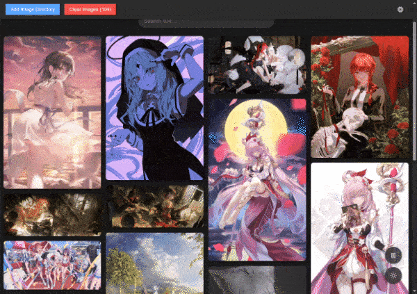

# Local Image Gallery
 

## Intro
A simple image gallery application that allows you to view images stored locally on your computer.

Features include:
- Browse and display images from multiple local directories(including subdirs).
- Drag & Drop support for adjusting image whereabouts.
- Easy navigation through images with arrow keys and mouse wheel.
- Zoom in/out functionality using arrow keys.
- Support for various image formats (JPEG, PNG, GIF, etc.).
- Exclude loaded images from gallery.

Note: a vibe-coding project

## Getting Started
- run locally with `npm run start`
- [use deployed version](https://camelliav-gallery.netlify.app/)

## Preview

- Browse and display images from multiple local directories.

- Support for various image formats (JPEG, PNG, GIF, etc.).
- Drag & Drop support for adjusting image whereabouts.

- Easy navigation through images with arrow keys and mouse wheel.
- Zoom in/out functionality using arrow keys.

- Exclude loaded images from gallery.

